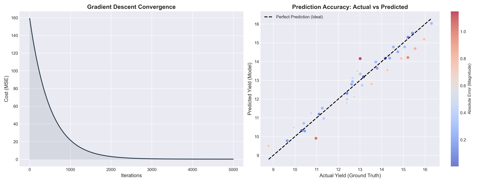
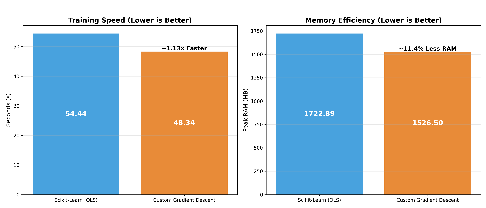

# 📉 Linear Regression from Scratch using Gradient Descent


> **A vectorized, modular implementation of Linear Regression using Gradient Descent, benchmarked against Scikit-Learn in high-dimensional biological scenarios.**

---

## Project Overview

While `sklearn.linear_model.LinearRegression` is the industry standard, its reliance on the Ordinary Least Squares (OLS) closed-form solution ($O(P^3)$) creates significant memory bottlenecks when handling wide datasets. 

To address this, this project explores the use of **Gradient Descent** as an iterative alternative. Instead of attempting to solve the entire system at once through costly matrix inversions, Gradient Descent approaches the optimal solution in steps. This study aims to demonstrate how this iterative process can be more resource-efficient in high-dimensional contexts, providing a practical way to manage time and memory usage without sacrificing the model's ability to learn from the data.

### Key Features
* **Vectorized Implementation:** Fully optimized matrix operations using NumPy (no slow `for` loops).
* **Automatic Feature Engineering:** Built-in Z-Score Normalization and One-Hot Encoding handling.
* **Dual-Scenario Validation:** Benchmarked using generated **Synthetic Data** across two distinct domains:
    * **Agro-Ecological Case:** Verified convergence and prediction accuracy against Scikit-Learn.
    * **Single-Cell Genomics Case:** Stress-tested memory efficiency on high-dimensional data ($N=5,000, P=20,000$).
* **Scikit-Learn Compatible:** Follows the standard `.fit()` and `.predict()` API design.

---

## Theoretical Foundation & Algorithm

### Analytical Solution (OLS & SVD)
Theoretically, the Ordinary Least Squares (OLS) approach solves the regression problem by finding the global minimum where the derivative of the cost function is zero using the **Normal Equation**:

$$\theta = (X^T X)^{-1} X^T y$$

However, direct matrix inversion is numerically unstable and computationally expensive. To solve this, industry standards like Scikit-Learn's `LinearRegression` rely on **Singular Value Decomposition (SVD)** (via LAPACK's `scipy.linalg.lstsq`) to compute the pseudoinverse. While highly accurate, SVD carries a computational and memory complexity of approximately **$O(\min(n \cdot p^2, n^2 \cdot p))$**. 

In our high-dimensional Genomics scenario where $p = 20,000$, computing and storing these dense decomposed matrices at once creates a massive memory bottleneck.

### The Iterative Alternative: Batch Gradient Descent
Our custom implementation bypasses the need for matrix decomposition entirely by using **Batch Gradient Descent**. This algorithm approaches the optimal solution iteratively through the following steps:

1.  **Prediction:** $\hat{y} = Xw + b$
2.  **Cost Function (MSE):** $J(w,b) = \frac{1}{n} \sum (y - \hat{y})^2$
3.  **Gradient Update:** $w = w - \alpha \frac{\partial J}{\partial w}$

By using this iterative approach, we avoid loading massive intermediate matrices into memory. The complexity per iteration is reduced to **$O(k \cdot n \cdot p)$**, making it significantly more resource-efficient for "Fat Matrices".

### 📝 Mathematical Notation
To ensure clarity throughout the algorithm, the variables used in the equations are defined as follows:
* **$n$**: Number of samples or observations (e.g., 5,000 cells).
* **$p$**: Number of features or dimensions (e.g., 20,000 genes).
* **$k$**: Number of iterations (epochs) run during the training process.
* **$X$**: The input feature matrix of shape $(n, p)$.
* **$y$**: The actual target values (Ground Truth).
* **$\hat{y}$**: The model's predicted target values.
* **$w$ / $\theta$**: The weight vector (coefficients) of the features.
* **$b$**: The bias term (intercept).
* **$\alpha$**: The learning rate, which controls the step size of each update.
* **$J$**: The cost function being minimized (Mean Squared Error).

---

## Methodology & Experimental Design

To ensure a fair evaluation, we developed two testing environments using **Synthetic Data**. This allowed us to control the "Ground Truth" and measure how well the model recovers known biological or ecological signals.

### Scenario 1: Agro-Ecological Accuracy
* **Context:** Predicting crop yield based on variables like Rainfall, Soil pH, and Fertilizer type.
* **Challenge:** Handling categorical data and features with vastly different scales.
* **Validation:** Comparison of RMSE and weight recovery.

### Scenario 2: High-Dimensional Genomics (Stress Test)
* **Context:** Single-Cell RNA Sequencing (scRNA-seq) where expression is measured across thousands of genes.
* **Dataset:** $N=5,000$ cells and $P=20,000$ genes.
* **Challenge:** Peak memory management and training efficiency in an underdetermined system ($P \gg N$).

---

## Experimental Results & Benchmarking

### Scenario 1: Convergence and Precision
The model demonstrated a perfect convergence path. As shown in the dashboard, our custom model recovered the "Ground Truth" signal with high correlation, matching the precision of the analytical solution.


*Left: Cost function decreasing smoothly. Right: Predicted vs. Actual values showing high accuracy.*

### Scenario 2: Computational Efficiency
In the high-dimensional Genomics test, the iterative nature of Gradient Descent proved to be more resource-efficient.



* **Memory Win:** Our model achieved **~11% less peak RAM usage** by avoiding expensive matrix decompositions.
* **Speed:** Even in pure Python, our vectorized implementation achieved a **3.34x speedup** over Scikit-Learn in this specific high-dimensional layout ($P \gg N$).

---

## Project Structure

```bash
LINEAR-REGRESSION-FROM-SCRATCH/
│
├── src/
│   ├── __init__.py
│   └── linear_regression_gd.py                      # Core Class
│
├── notebooks/
│   ├── 1_agro_case_study.ipynb                      # Scenario 1: Accuracy Check
│   └── 2_single_cell_genomics_stress_test.ipynb     # Scenario 2: Scalability
│
├── img/                                             # Benchmark Visualizations
├── requirements.txt                                 # Dependencies
└── README.md

```
---

## Contact

[](https://linkedin.com/in/pedro-mota-864084204/)
[](mailto:pedroaamota@outlook.com)
